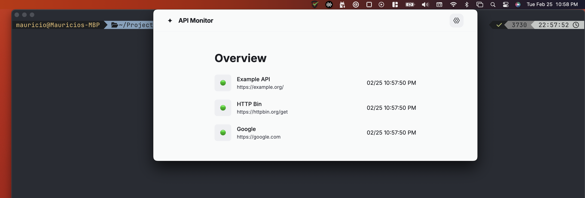

# check-health

Electron MVP menubar application for hitting API endpoints and checking their health.



## To build:

1. `npm install`
2. `npm run make`
3. Run the application from the `./out` folder

## Configuring the application

Create a `$HOME/.check-health/config.json` file in the following format:

```json
{
  "intervalMS": 60000,
  "resultsToTrack": 15,
  "apis": [
    {
      "name": "Example API",
      "url": "https://example.org/"
    },
    {
      "name": "HTTP Bin",
      "url": "https://httpbin.org/get",
      "expression": {
        "key": "url",
        "value": "https://httpbin.org/get"
      }
    },
    {
      "name": "Google",
      "url": "https://google.com"
    }
  ]
}
```

The application will check that the return HTTP GET request returns a 2-hundred level status. If an expression is included in the API's config, they `key` will be checked for the `value`. The `key` can be a nested key like `data.health.status`.